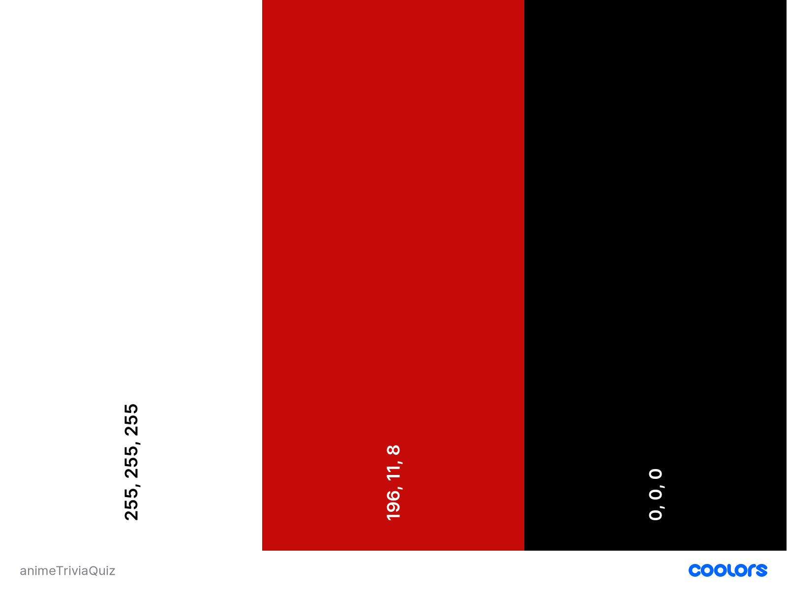

# Anime Trivia Quiz 

## Contents 
---
  * [UX (User Experience)](#ux--user-experience-)
    + [Project Goals](#project-goals)
    + [User Goals](#user-goals)
    + [User Stories](#user-stories)
    + [Site Owner Goals](#site-owner-goals)
    + [User Requirements and Expectations](#user-requirements-and-expectations)
    + [Design Choices](#design-choices)
    + [Wireframing](#wireframing)
  * [Technologies Used](#technologies-used)
  * [Features](#features)
  * [Testing](#testing)
  * [Bugs](#bugs)
  * [Deployment](#deployment)
  * [References](#references)
    + [Code References](#code-references)
    + [Investment Information Sources](#investment-information-sources)
    + [Image Sources](#image-sources)
    + [Special Thanks](#special-thanks)

## UX (User Experience) 
---
### Project Goals 
* To build a trivia question web app on anime and manga with multiple choice questions.

### User Goals 
* Have my Japanese anime and manga knowledge challenge.
* Challenge myself to beat my previous high score.
* Have fun!

### User Stories 

* As a **user**, I want the web app to be **easy to use** and **is easy to learn to use**.
* As a **user**, I want to **have fun** without **interruptions from errors or bugs**.
* As a **user**, I want the **questions to be randomised** so I can come back to the **challenge with new questions** every-time. 
* As a **user**, should be able to have my **top score saved** to beat next time or challenge others to do so. 
* As a **user**, I would like to **know my progress** through the test in terms of **how much** of test **has been completed**.

### Site Owner Goals 
* As a **site owner**, to entertain and keep user coming back to take the challenge again to beat the top score.
* As a **site owner**, make the quiz fun for the user!

### User Requirements and Expectations 

**Requirements**
* Web application should be on the header part of front-page to dominate the webpage.
* Should be a one page website that has only web app on display to avoid distracting user from main feature.
* Should be without lag and have good performance to make experience comfortable and easy.
* A start page that displays top score and user presses button to begin quiz.
* End of quiz should show a page to save score by entering name and a choice to restart quiz.

**Expectations**
* Visually appealing website that is easy on the eyes and make the UX very positive emotionally.
* Looks fun and the colour schemes should relax user to enjoy their free time.
* Satisfy all user goals to the best of ability by including all relevant features, user should feel site was very enjoyable.

### Design Choices 
---
**Fonts**

I looked for a simple and asthetically pleasing font to match typical holiday themes of relaxations and good times. I chose [Bubblegum Sans](https://fonts.google.com/specimen/Bubblegum+Sans?preview.text_type=custom&sidebar.open=true&selection.family=Bubblegum+Sans) for all texts and headers. 

**Colours**

I chose to use the [Coolors](https://coolors.co/) colour scheme generator to find one suitable for this project. Below is a screenshot of the colour scheme. They are colours that are pleasant and to look.



**Background Image**

I used a [manga panel wallpaper](https://www.reddit.com/r/wallpaper/comments/i5f7ua/animemanga_crossover_wallpaper_19201080/) as the background to match the theme of anime/manga in the design of web application.


### Wireframing 

For **wireframing**, I used [Balsamiq](https://balsamiq.com/). I used it to create **simple** wireframes 
showing the basic structure on which I built the website on. Some features maybe removed or added during 
development. 

View wireframes for each device here:

**Start Page**
* [Desktop](wireframes/start-page-desktop.pdf)
* [Tablet](wireframes/start-page-tablet.pdf)
* [Mobile](wireframes/start-page-mobile.pdf)

**Question and Answer Page**
* [Desktop](wireframes/desktop-qa.pdf)
* [Tablet](wireframes/tablet-qa.pdf)
* [Mobile](wireframes/mobile-qa.pdf)

**End Page**
* [Desktop](wireframes/end-page-desktop.pdf)
* [Tablet](wireframes/end-page-tablet.pdf)
* [Mobile](wireframes/end-page-mobile.pdf)

## Technologies Used 
---
**Languages**

* [HTML](https://developer.mozilla.org/en-US/docs/Web/HTML)
* [CSS](https://developer.mozilla.org/en-US/docs/Web/CSS)
* [JavaScript](https://en.wikipedia.org/wiki/JavaScript)

**Tools & Libraries**

* [Bootstrap](https://getbootstrap.com/)
* [Google Fonts](https://fonts.google.com/)
* [Gitpod](https://gitpod.io/)
* [JQuery](https://jquery.com/) 
* [Popper](https://popper.js.org/)

## Features 
---
**Features** that have been **implemented**:
* Ten questions per quiz attempt
* Multiple choice answers
* Score keeping
* Progress bar

**Features** that will be **implemented** in the **future**:
* Saving and displaying high score at the end of the quiz

## Testing 
---

### Game is fun!
**User Story: I want to have fun and enjoy the game.**
* **Plan**<br>Give the user questions that are challenging with varying difficulty levels and ask about a wide variety of anime.
* **Implementation**<br>I have included questions of all difficulty level that are randomly selected in order to catch the user by surprise and challenge them.
* **Test**<br>I asked my sister who is a huge anime and manga fan to test it out. 
* **Results**<br>She found it really fun and challenging. The challenging questions were the most satisfying to solve for her.
* **Verdict**<br>The test has passed all the criteria and works as intended.

### Easy to Learn to Use
**User Story: I want to easily learn how to play the game with little complication.**
* **Plan**<br>Build the quiz game as simple as possible so that no instructions are needed. User learns to use it immediately.
* **Implementation**<br>Kept the UI simple and easy to deal with. Creates an effect on buttons and answer choices to change colour during mouse hover event. This allows users to know what to click. I also avoided including unnecessary features that was not relevant. 
* **Test**<br>I asked my sister to test it out.
* **Results**<br>She immediately was able to start and complete the game without giving her instructions. She said there was no problem.
* **Verdict**<br>The test has passed all the criteria and works as intended.

### Questions are randomly chosen
**User Story: As a user, I want the questions to be randomised so I can come back to the challenge with new questions every-time.**
* **Plan**<br>To selected random question each user begins or proceeds to new question.
* **Implementation**<br>I passed the ```questionData``` variable, containing an array of questions along with their corresponding answers, as argument to ```addQuestion()```. Declared variable ```random``` that selects a random number within the range of the array length. I then used this variable as an index to the ```questionData``` array when selecting each question.
* **Test**<br>I took the quiz 5 times and my sister did it twice.
* **Results**<br>The questions displayed were randomized and rarely appeared.
* **Verdict**<br>The test passed all the criteria and works as intended. It will be more random with addition of more questions in the future.

### Saving and displaying top score to challenge user
**As a user, should be able to have my top score saved to beat next time or challenge others to do so.**
* **Plan**<br>To allow user to save their score and to display high scores to challenge new users or the same user to try it again.
* **Implementation**<br>It has not yet been implemented.
* **Test**<br>I shall test once I have implemented.
* **Results**<br>No results yet.
* **Verdict**<br>It has not been implemented due to lack of time as most of the time was occupied working on the other functionalities. It shall be implemented in the future.

### Displaying user progress
**As a user, I would like to know my progress through the test in terms of how much of test has been completed.**
* **Plan**<br>To allow the user to know where they are in their progress of the quiz and what question they are on.
* **Implementation**<br>To display a progress bar that fills up as user progresses through the quiz and display how many questions have been completed.
* **Test**<br>I manually tested the quiz by going through it 15 times.
* **Results**<br>The progress bar was displayed with no problem and updates with each question. The question counter increments correctly by one with each question.
* **Verdict**<br>The test has passed all the criteria and works as intended.

## Bugs 
---
### When answer is clicked, the event is repeated

* **Bug**<br>Each time the user selects an answer, whether it is correct or incorrect, the click event is repeated. The click event repetitions doubled with each additional click the user made. For example, when the user clicks to choose answer to second question, it iterated the click twice and fetches two question instead of just one. On third click, it iterated the click four times and fetched four questions.

* **Fix**<br>I refactored the code so that the fetch request inside the function ```apiQuestion()``` is limited to fetching the data and declaring it in a variable to be passed to ```addQuestion()``` and ```addChoices()``` functions. Before code refactoring, ```apiQuestion()``` also handled the functionality of displaying questions and choices to the quiz. I separated these into their own functions to improve readability so I could find the bug and avoid more potential bugs.<br>As I was writing the code, I used ```console.log()``` with each line of code to see where the bug appeared. It appear where I was using ```addEventListener()``` and for the sake of speed, I used JQuery's click event handler ```.click()``` alongside ```.unbind()``` .

* **Verdict**<br>The click event listener works and the intended result has been achieved. I may return to it in order to improve it further. 

### Slow performance when changing questions

* **Bug**<br>It looks a relatively long time to move on to the next question when the users chose an answer. Within that time period when waiting for the next question, if users clicked on the answer again it would add to the number of questions it was going to retrieve. This in turn added to the time waiting for a new question.

* **Fix**<br>Instead of making a fetch request for each new question, I requested all relevant questions once at the start of application. I declared this data in a variable ```questionData``` and passed it to ```addQuestion()``` function to use it to select a question from the available questions. 

* **Verdict**<br>Performance has enormously improved and the side effect of poor performance, which is the potential for users to click on answer multiple times to increase time delay, has been avoided. 

### Answer is still highlighted from previous question

* **Bug**<br>On mobile and tablets, the answer is still highlighted in the next question after user taps on answer. 

* **Fix**<br>I shall leave it to be fixed later.

* **Verdict**<br>It does not affect the functionality of the game. It just does not look good but it can be fixed later since it is not urgent. 

### Quiz page was not responsive in landscape mode

* **Bug**<br>On mobile screens, the quiz page was not responsive because the top and bottom of the page would be cut off. The page also did not allow for scrolling up and down the page when this was the case. 

* **Fix**<br>For now, I set up the page to display a message telling user that the game is best played in portrait mode when the user turns device to landscape mode.

* **Verdict**<br>The overall functionality of the game has not been affected and this bug is not high on the priority list. I shall return to it later on.

### Quiz page is not responsive on narrow screens

* **Bug**<br>On screens with narrow width (<320px) like Galaxy Fold and iPhone 5/SE, the page is not responsive in that the top and bottom of the page is cut off. It also does not allow scrolling when this is the case.

* **Fix**<br>I shall return to it later. 

* **Verdict**<br>The game works on all other devices I tested it on. It just is not reponsive on the Galaxy Fold and iPhone 5/SE so I would recommend users use other devices, if not a different mobile, a computer or tablet. It will be fixed later on since it is not much of a priority and there is a lack of time.

### Possibility of queueing up click events

* **Bug**<br>Through testing, I found out that sometimes when user is moving on to next question, there may be a delay. The user could take it as they may need to make another click to make it work. They may assume they either did not click properly or did not click at all. When repeated clicks are made, the repeated call to ```apiQuestion()``` function is queued up and multiple questions are iterated through. It takes the repeated click as the answer to all the queued up questions.

* **Fix**<br>It has not been fixed yet.

* **Verdict**<br>It does not happen often and it shall be fixed later on. Apart from these uncommon occasions, it works as intended.

## Deployment 
---
This project was deployed via GitHub by executing the following steps. After writing the code, committing and pushing it to GitHub:

* Navigate to the repository on github and click **Settings**.
* From there, go to the **Source section** within the Github Pages section.
* Select **master branch** on the dropdown menu, and click save.
* Now the website is live on:
```https://yourgithubusername.github.io/your-repo-name```
* Any time commits and pushes are sent to Github, the Github Pages site should update shortly after.

To run the project locally:
Click the **green Clone** or **Download button** on the Github Repository
Using the **Clone with HTTPS option**, copy the link displayed.
Open your IDE, and ensure the Git Terminal is open.
Change the working directory to the location where the cloned directory is to go.
Use the **"git clone" command** and paste the url copied in the second step.

## References 
---
### Code References 
* [Fisher-Yates Shuffle Algorithm](https://stackoverflow.com/questions/2450954/how-to-randomize-shuffle-a-javascript-array)
* [How to assign the innerHTML of array elements to the values in another array](https://stackoverflow.com/questions/62235124/how-to-assign-the-innerhtml-of-array-elements-to-the-values-in-another-array)
* [Using fetch](https://developer.mozilla.org/en-US/docs/Web/API/Fetch_API/Using_Fetch)
* [Displaying each answers array value in each .answer-container](https://stackoverflow.com/questions/62235124/how-to-assign-the-innerhtml-of-array-elements-to-the-values-in-another-array)
* [Select Random Item from an Array](https://css-tricks.com/snippets/javascript/select-random-item-array/)
* [Javascript Object Values](https://www.w3schools.com/jsref/jsref_obj_array.asp)

### Special Thanks 
* First and foremost, I would like to thank my mentor and the Grandmaster Yoda [Eventyret](https://github.com/Eventyret). He helped me calm down during stressful moments and gave me golden advice to keep pushing forward.
* I would also like to thank the Code Institute tutors who had to deal with all my endless questions and trying to make sense of my spaghetti code. 
* I would like to thank the Code Institute Slack community who are always helpful and encouraging. 
* My friend, [Said Ali](https://github.com/said-ali?tab=repositories), was helpful in getting me out of trouble when I was stuck and I thank him too.
* My sister, Hawa, who is an artist and fellow anime fan for giving me some suggestions on UI and for testing the quiz app.
* [ByIlsa](https://github.com/byIlsa/Aloy-from-outcast-to-heroine) and [Anouk Smet](https://github.com/AnoukSmet/Brain-Quizzers) for their awesome, well-structured READMEs that helped me to write mine.

**For educational purposes only.**