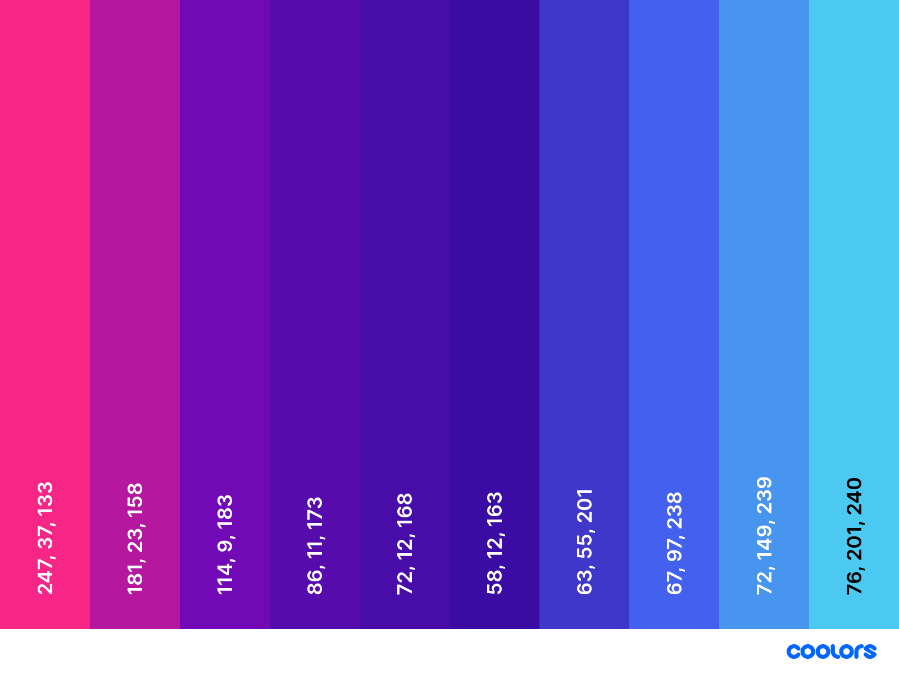

# Anime Trivia Quiz 

## Contents 
---
  * [UX (User Experience)](#ux--user-experience-)
    + [Project Goals](#project-goals)
    + [User Goals](#user-goals)
    + [User Stories](#user-stories)
    + [Site Owner Goals](#site-owner-goals)
    + [User Requirements and Expectations](#user-requirements-and-expectations)
    + [Design Choices](#design-choices)
    + [Wireframing](#wireframing)
  * [Technologies Used](#technologies-used)
  * [Features](#features)
  * [Testing](#testing)
  * [Bugs](#bugs)
  * [Deployment](#deployment)
  * [References](#references)
    + [Code References](#code-references)
    + [Investment Information Sources](#investment-information-sources)
    + [Image Sources](#image-sources)
    + [Special Thanks](#special-thanks)

## UX (User Experience) 
---
### Project Goals 
* To build a trivia question web app on anime and manga with multiple choice questions.

### User Goals 
* Have my Japanese anime and manga knowledge challenge.
* Challenge myself to beat my previous high score.
* Have fun!

### User Stories 

* As a **user**, I want the web app to be **easy to use** and **is easy to learn to use**.
* As a **user**, I want to **have fun** without **interruptions from errors or bugs**.
* As a **user**, I want the **questions to be randomised** so I can come back to the **challenge with new questions** every-time. 
* As a **user**, should be able to have my **top score saved** to beat next time or challenge others to do so. 
* As a **user**, I would like to **know my progress** through the test in terms of **how much** of test **has been completed**.

### Site Owner Goals 
* As a **site owner**, to entertain and keep user coming back to take the challenge again to beat the top score.
* As a **site owner**, make the quiz fun for the user!

### User Requirements and Expectations 

**Requirements**
* Web application should be on the header part of front-page to dominate the webpage.
* Should be a one page website that has only web app on display to avoid distracting user from main feature.
* Should be without lag and have good performance to make experience comfortable and easy.

**Expectations**
* Visually appealing website that is easy on the eyes and make the UX very positive emotionally.
* Looks fun and the colour schemes should relax user to enjoy their free time.
* Satisfy all user goals to the best of ability by including all relevant features, user should feel site was very enjoyable.

### Design Choices 
---
**Fonts**
I looked for a simple and asthetically pleasing font to match typical holiday themes of relaxations and good times. I chose [Palanquin](https://fonts.google.com/specimen/Palanquin?category=Sans+Serif&sort=popularity&query=pa#standard-styles) for all texts and headers. 

**Colours**
I chose to use the [Coolors](https://coolors.co/f72585-b5179e-7209b7-560bad-480ca8-3a0ca3-3f37c9-4361ee-4895ef-4cc9f0) colour scheme generator to find one suitable for this project. Below is a screenshot of the colour scheme. They are colours that are pleasant and to look.

### Wireframing 

For **wireframing**, I used [Balsamiq](https://balsamiq.com/). I used it to create **simple** wireframes 
showing the basic structure on which I built the website on. Some features maybe removed or added during 
development. 

View wireframes for each device here:

* [Desktop](wireframes/desktop.png)
* [Tablet](wireframes/mobile.png)
* [Mobile](wireframes/tablet.png)

## Technologies Used 
---
**Languages**

* [HTML](https://developer.mozilla.org/en-US/docs/Web/HTML)
* [CSS](https://developer.mozilla.org/en-US/docs/Web/CSS)
* [JavaScript](https://en.wikipedia.org/wiki/JavaScript)

**Tools & Libraries**

* [Bootstrap](https://getbootstrap.com/)
* [Google Fonts](https://fonts.google.com/)
* [Gitpod](https://gitpod.io/workspaces/)
* [JQuery](https://jquery.com/) 
* [Popper](https://popper.js.org/)

## Features 
---
**Features** that have been **implemented**:

**Features** that will be **implemented** in the **future**:

## Testing 
---

### Game is fun!
**User Story: I want to have fun and enjoy the game.**
* **Plan** 
* **Implementation** 
* **Test** 
* **Results** 
* **Verdict** 

### Easy to learn
**User Story: I want to easily learn how to play the game with little complication.**
* **Plan** 
* **Implementation** 
* **Test** 
* **Results** 
* **Verdict** 

## Bugs 
---

## Deployment 
---

## References 
---
### Code References 

### Special Thanks 